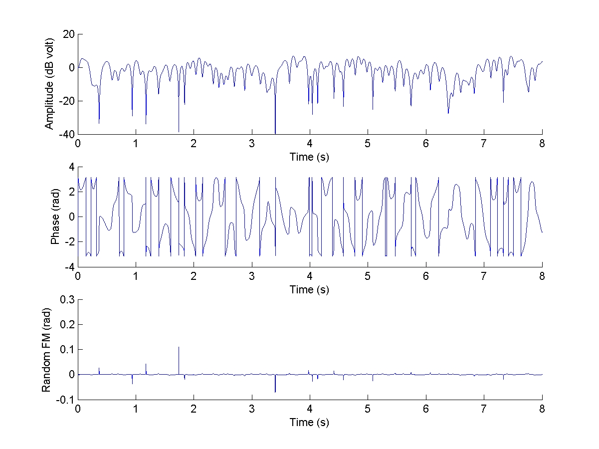
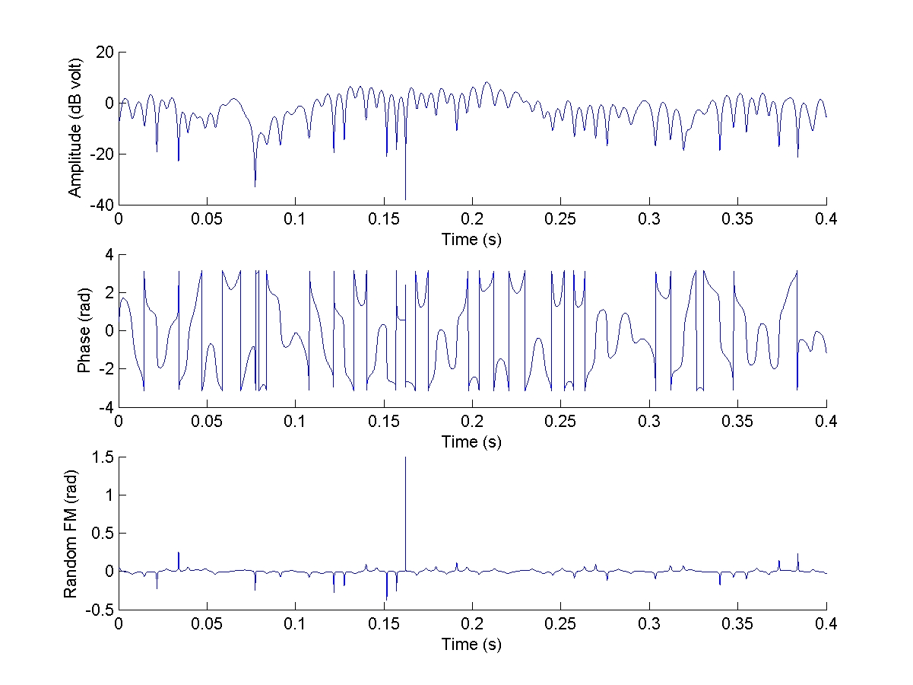
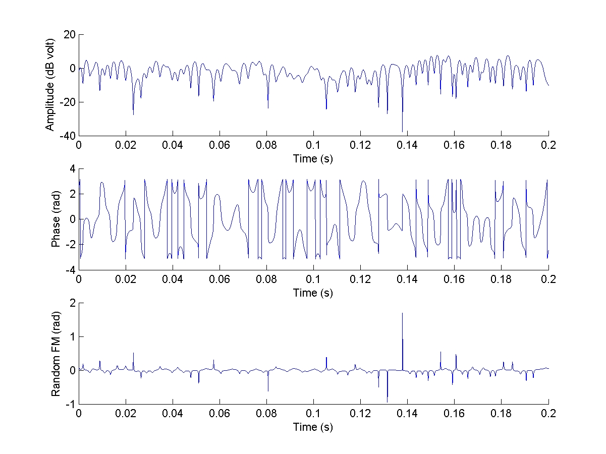
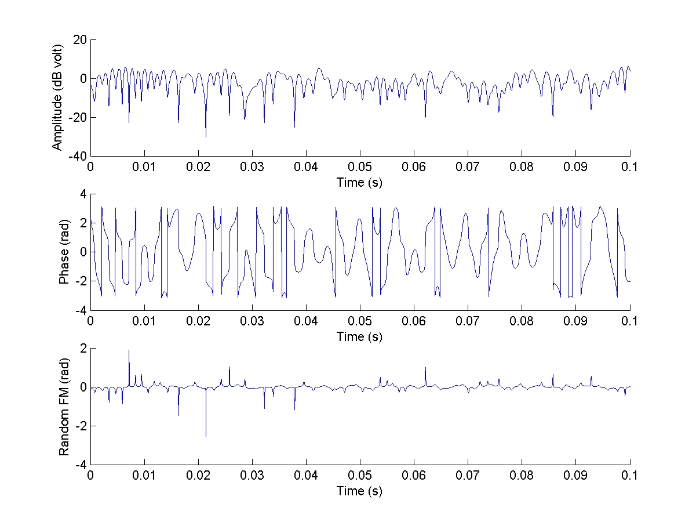
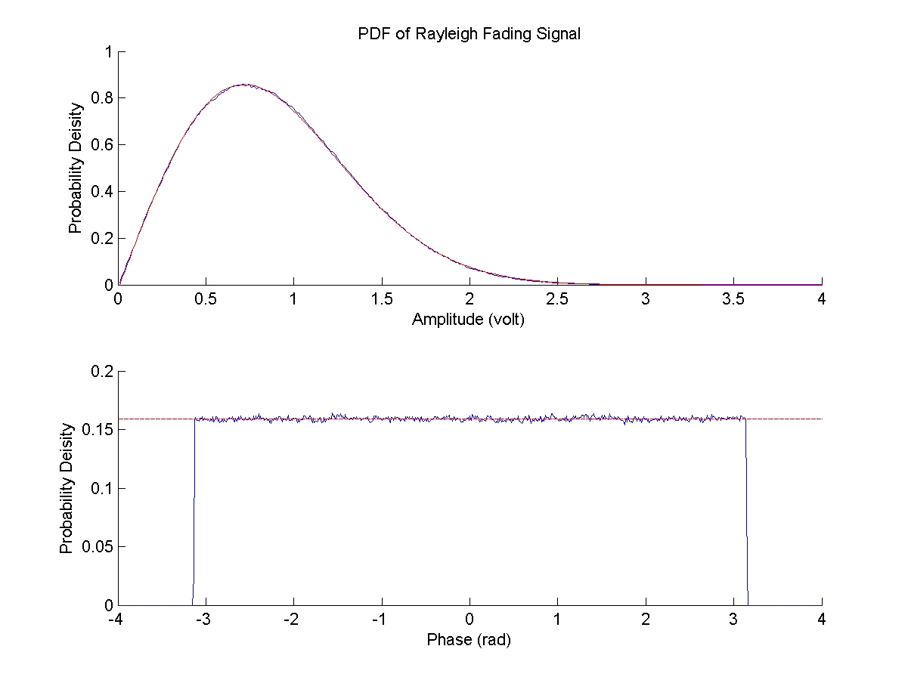

### Jakes Fading Model

Generate Rayleigh fading pattern by using Jakes Model for the simulation of wireless communication systems over multipath fading channel

* Rayleigh fading patterns (Amplitude, Phase, Random FM)
* Probability distribution (Amplitude: Rayleigh distribution, Phase: Uniform distribution)

#### Evaluation

